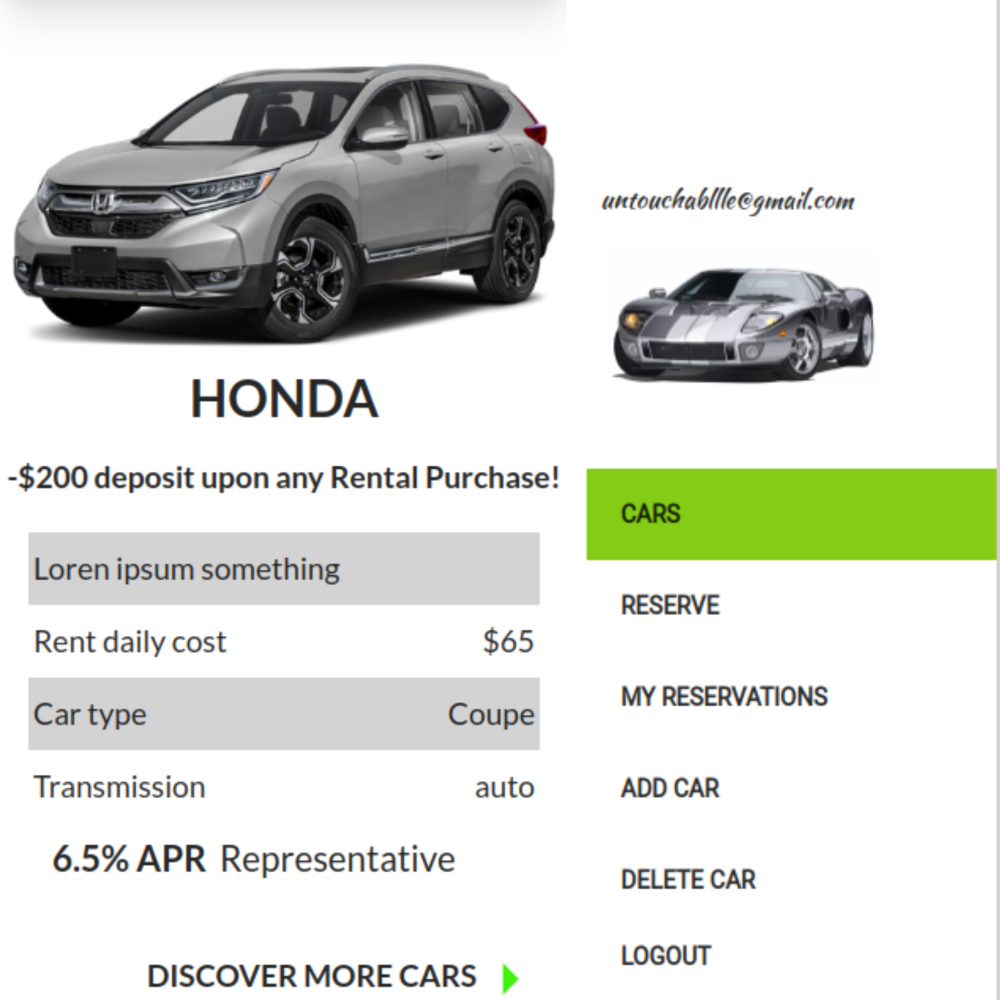

# Rent A Car

<div id="top"></div>
<!-- PROJECT LOGO -->
<div align="center">
  <a href="https://github.com/Gegardus/book-a-car-frontend">
    
  </a>

  <h1 align="center">Rent A  Car</h1>

  <p align="center">
    A car rental website
    <br />

## Backend Repository Link

<a href="https://github.com/VuDej/final-capstone-back-end/">Book A Car Backend</a>

<a href="https://github.com/Gegardus/book-a-car-frontend#readme"><strong>Explore the docs »</strong></a>
<br />
<br />
 <a href="[https://final-capstone-back.herokuapp.com/index.html](https://frontend-rent-a-car.herokuapp.com/)">View Demo</a>
.
<a href="https://github.com/Gegardus/book-a-car-frontend/issues">Report Bug</a>
·
<a href="https://github.com/Gegardus/book-a-car-frontend/issues">Request Feature</a>

</div>

<!-- TABLE OF CONTENTS -->
<details>
<summary align="center">Table of Contents</summary>

- [Rent A Car](#rent-a-car)
  - [Backend Repository Link](#backend-repository-link)
  - [Live Link](#live-link)
  - [Screenshots](#screenshots)
  - [Description 🏗️](#description-️)
  - [Getting Started 🏁](#getting-started-)
    - [Prerequisites and Dependencies 📜](#prerequisites-and-dependencies-)
    - [Clone this repository](#clone-this-repository)
    - [Move into the directory with](#move-into-the-directory-with)
    - [Install linter](#install-linter)
    - [Start server](#start-server)
    - [Install linter](#install-linter-1)
    - [Run linter](#run-linter)
      - [Auto-correct](#auto-correct)
  - [Built With 🔨](#built-with-)
  - [Authors ✍️](#authors-️)
  - [🤝 Contributors](#-contributors)
  - [📝 License](#-license)
  - [Show your support 💪](#show-your-support-)
  - [Acknowledgments](#acknowledgments)
  </details>

<!-- About the project -->

[App screenshot](https://example.com)

## Screenshots



## Description 🏗️

This is a car rental website that allows you to view a variety of cars and book them at different rates. User can see all models and model details and rerve car. Admin can add and delete car.

<p align="right">(<a href="#top">back to top</a>)</p>

## Getting Started 🏁

### Prerequisites and Dependencies 📜

You will be needing:

- A terminal terminal
- A code editor
- React(follow the instructions based on your OS)
  ```bash
  https://reactjs.org/docs/create-a-new-react-app.html
  ```

### Clone this repository

```bash
git clone https://github.com/Gegardus/book-a-car-frontend.git
```

### Move into the directory with

```bash
cd book-a-car-frontend
```

### Install linter

```bash
npm install
```

### Start server

```bash
npm start
```

### Install linter

For Ruby and Rails run:

```bash
npm install
```

### Run linter

For Stylelint:

```bash
npx stylelint "**/*.{css,scss}"
```

#### Auto-correct

For stylelint:

```bash
npx stylelint "**/*.{css,scss}" --fix
```{
  "env": {
    "browser": true,
    "es6": true,
    "jest": true
  },
  "parser": "@babel/eslint-parser",
  "parserOptions": {
    "ecmaFeatures": {
      "jsx": true
    },
    "ecmaVersion": 2018,
    "sourceType": "module"
  },
  "extends": ["airbnb", "plugin:react/recommended"],
  "plugins": ["react"],
  "rules": {
    "react/jsx-filename-extension": ["warn", { "extensions": [".js", ".jsx"] }],
    "react/react-in-jsx-scope": "off",
    "import/no-unresolved": "off",
    "no-shadow": "off"
  },
  "ignorePatterns": [
    "dist/",
    "build/"
  ]
}

```bash
npm start
```

<p align="right">(<a href="#top">back to top</a>)</p>

## Built With 🔨

<div align="center">

|     | Languages                                                                                                                                                                                                               |     |
| --- | ----------------------------------------------------------------------------------------------------------------------------------------------------------------------------------------------------------------------- | --- |
|     |   |     |

</div>

<div align="center">

|     | Tools 🛠️                                                                                                                                                                                                                                                                                                                                                                                                                                                                              |     |
| --- | ------------------------------------------------------------------------------------------------------------------------------------------------------------------------------------------------------------------------------------------------------------------------------------------------------------------------------------------------------------------------------------------------------------------------------------------------------------------------------------- | --- |
|     |     |     |

<p align="right">(<a href="#top">back to top</a>)</p>
</div>

## Authors ✍️

<div align="center">

| 👤 vudej |
| -------- |

| <a target="_blank" href="https://github.com/VuDej"></a> <a target="_blank" href="https://www.linkedin.com/in/dejan-vujovic/"></a> <a target="_blank" href="https://twitter.com/DejanVuj"></a>
|

| 👤 Abdulfatai Badara |
| -------------------- |

|<a target="_blank" href="https://github.com/fobadara"></a> <a target="_blank" href="https://www.linkedin.com/in/fob90s"></a> <a target="_blank" href="https://twitter.com/fob90s"></a>  
<a target="_blank" href="mailto:fob90s@gmail.com"></a> <a target="_blank" href="https://wa.me/+2349066478370"> </a>
(Click any of the badges to reach me. Especially whatsapp)|

| 👤 Vahan |
| -------- |

| <a target="_blank" href="https://github.com/Gegardus"></a> <a target="_blank" href="https://www.linkedin.com/in/vahan-khachvankian"></a> <a target="_blank" href="https://twitter.com/Gegardus"></a>
|

| 👤 Tresor |
| --------- |

| <a target="_blank" href="https://github.com/tresorsawasawa"></a> <a target="_blank" href="https://www.linkedin.com/in/tresor-sawasawa/"></a> <a target="_blank" href="https://twitter.com/TresorSawasaw"></a>  
|

| 👤 francis |
| ---------- |

| <a target="_blank" href="https://github.com/githubhandle"></a> <a target="_blank" href="https://linkedin.com/in/linkedinhandle"></a> <a target="_blank" href="https://twitter.com/twitterhandle"></a>  
|

</div>

<p align="right">(<a href="#top">back to top</a>)</p>

## 🤝 Contributors

Contributions, issues, and feature requests are greatly appreciated!

If you have a suggestion that would make this better, please fork the repo and create a pull request. You can also simply open an issue with the tag "improvements".

- Fork the Project
- Create your Feature Branch (git checkout -b feature/yourfeaturename)
- Commit your Changes (git commit -m 'Add suggested feature')
- Push to the Branch (git push origin feature/AmazingFeature)
- Open a Pull Request

Feel free to check the [issues page](https://github.com/Gegardus/book-a-car-frontend/issues).

<p align="right">(<a href="#top">back to top</a>)</p>

## 📝 License

This project is licensed by [](LICENSE)

## Show your support 💪

Give a ⭐️ if you like this project!

## Acknowledgments

- Hat tip to [Murat Korkmaz](https://www.behance.net/gallery/26425031/Vespa-Responsive-Redesign/modules/173005583) for the design idea.

<p align="right">(<a href="#top">back to top</a>)</p>
